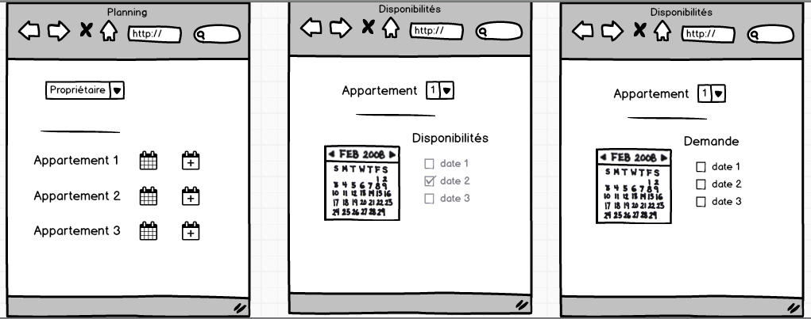

# Challenge réservation logement
Créer une application simple sur le type airbnb :
L'application permet de
* créer un propriétaire
* créer un logement
* faire un planning de disponibilité
* faire une recherche des logements libres pour une ville est une période.

Instructions :
* Vous utiliserez le design pattern MVC : servlets, jsp, javabean et DAO.
* Faites des pages modernes et responsive en utilisant Bootstrap
* Il n'y a pas d'identification via un user pour se connecter à l'application
* Il n'y a que des créations de propriétaire, logement, planning (pas de maj ni suppression)
* Lors de l'ajout d'une disponibilité, vous ne devez pas afficher l'id du logement. Cependant celui-ci devra être connu pour la création de la disponibilité dans la base.

Voici le MOO

Le use case diagram (cas d'utilisation)

  

Et la description des écrans (Mockups)

* sur le site [moqups.com](https://app.moqups.com/elepevedic@simplon.co/O104LLvtVw/edit/page/a540ac51f)  -> mockup dynamique mais payant

* et sur le site [balsamiq.com](https://airbnbapp.mybalsamiq.com/projects/airbnbapp/edit/airbnbapp_mockup)

que je mets ici :

 

